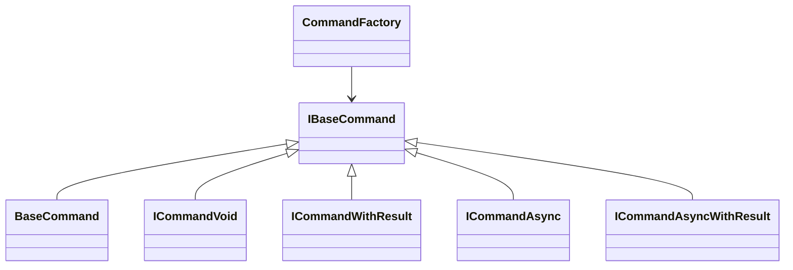

# Command Pattern

GameFoundations implements a lightweight command pattern that builds on VContainer to resolve dependencies at runtime. Commands encapsulate a single unit of work (synchronous or asynchronous) and are produced via `ICommandFactory`.

## Core Types

Namespace: `Darkmatter.Core.Services.CommandFactory`

- `BaseCommand` – Abstract class storing an injected `IObjectResolver` instance.
- `IBaseCommand` – Declares `SetResolver` and `ResolveDependencies`.
- `ICommandVoid` – Synchronous command without a return value (`void Execute()`).
- `ICommandWithResult<TReturn>` – Synchronous command returning a value.
- `ICommandAsync` – Asynchronous command returning a `UniTask`.
- `ICommandAsyncWithResult<TReturn>` – Asynchronous command returning a `UniTask<TReturn>`.
- `CommandFactory` – Concrete factory that instantiates commands, injects the resolver, and calls `ResolveDependencies`.



## Creating a Command

1. Derive from `BaseCommand` and implement one of the command interfaces.
2. Override `ResolveDependencies()` to pull collaborators from `ObjectResolver`.
3. Implement `Execute` according to the interface contract.

```csharp
using System.Threading;
using Cysharp.Threading.Tasks;
using Darkmatter.Core.Services.CommandFactory;
using Darkmatter.Core.Services.CommandFactory.Interfaces;

public sealed class PlayMusicCommand : BaseCommand, ICommandAsync
{
    private IAudioService _audio;

    public override void ResolveDependencies()
    {
        _audio = ObjectResolver.Resolve<IAudioService>();
    }

    public async UniTask Execute(CancellationTokenSource cts)
    {
        await _audio.PlayAudioAsync("MainTheme", AudioChannelType.Music, cts);
    }
}
```

## Executing Commands

Inject `ICommandFactory` into the consuming system (via VContainer) and create commands on demand:

```csharp
public sealed class IntroSequence
{
    private readonly ICommandFactory _commandFactory;

    public IntroSequence(ICommandFactory commandFactory)
    {
        _commandFactory = commandFactory;
    }

    public async UniTask RunAsync(CancellationTokenSource cts)
    {
        var command = _commandFactory.CreateCommandAsync<PlayMusicCommand>();
        await command.Execute(cts);
    }
}
```

`CommandFactory` always:

1. Creates the command using `new()`.
2. Calls `SetResolver` with the ambient `IObjectResolver`.
3. Invokes `ResolveDependencies`.

This ensures commands stay stateless between runs and always operate on the latest service instances.

## Return Values and Sync Commands

| Interface                          | Use Case                                      | Execute Signature                            |
|------------------------------------|-----------------------------------------------|----------------------------------------------|
| `ICommandVoid`                     | Fire-and-forget synchronous logic             | `void Execute()`                             |
| `ICommandWithResult<TReturn>`      | Synchronous logic that returns a value        | `TReturn Execute()`                          |
| `ICommandAsync`                    | Asynchronous logic without a return value     | `UniTask Execute(CancellationTokenSource)`   |
| `ICommandAsyncWithResult<TReturn>` | Asynchronous logic that returns a value       | `UniTask<TReturn> Execute(CancellationTokenSource)` |

Mix and match based on the amount of coordination your feature requires. Always forward cancellation tokens for long-running jobs so callers can stop work cleanly.

## Best Practices

- Keep commands small; they should represent a single operation (load profile, play timeline, spawn enemy).
- Avoid caching resolved dependencies in static fields—commands are cheap to instantiate when needed.
- Compose complex flows by chaining commands rather than creating a single multi-purpose command.
- For testing, mock `IObjectResolver` or inject a custom factory that feeds test doubles.
